<h3><code>gustavo@github ~ $ whoami</code></h3>

<table>
  <tr>
    <td valign="top"></td>
    <td valign="top"></td>
  </tr>
</table>

 

<h3><code>gustavo@github ~ $ ./contributions.sh</code></h3>

  

<a href="https://gustavgomes.com.br">gustavgomes.com.br</a> &nbsp;·&nbsp;
<a href="https://www.instagram.com/devguga/">instagram</a> &nbsp;·&nbsp;
<a href="https://github.com/devgugga?tab=repositories">repositories</a>

